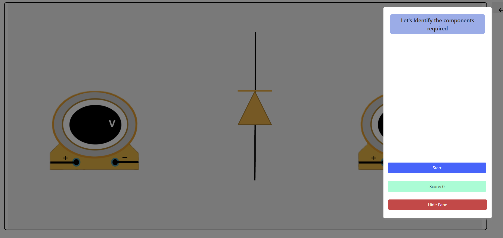
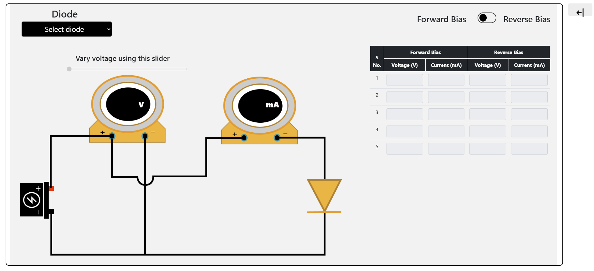
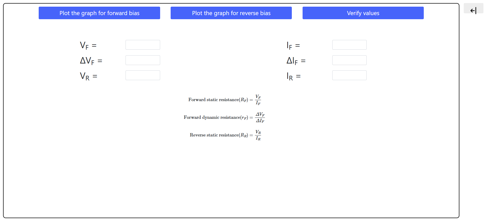
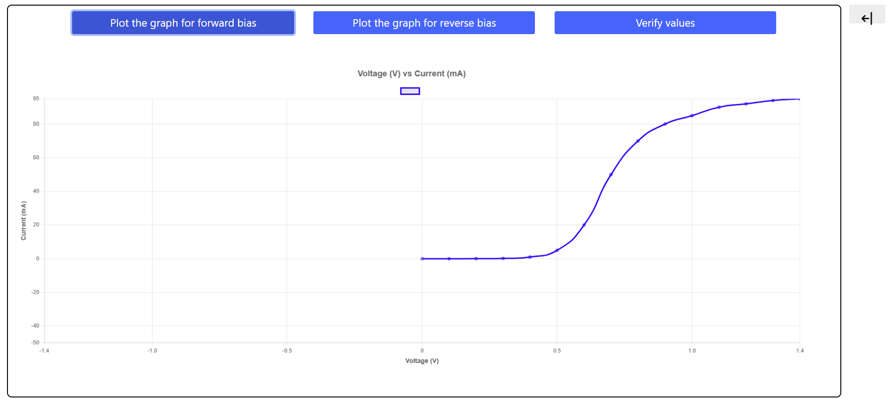
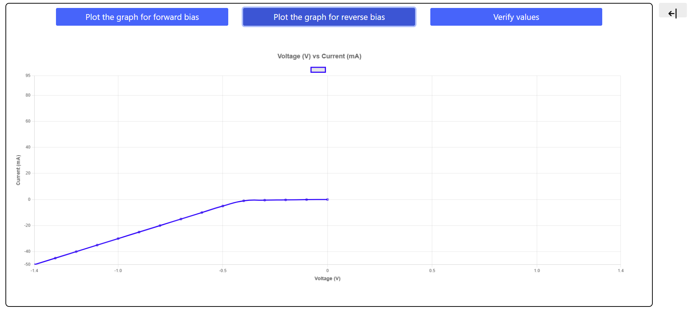

<h2>Procedure</h2>

<h3>STEP 1:</h3>

Follow the instructions and identify the components.

<h3>STEP 2:</h3>

Follow the instructions and take required readings for forward and reverse bias.

<h3>STEP 3:</h3>

Verify these values using graph.

Least count of voltmeter = __________V

Least count of milliammeter = __________mA

Least count of micro-ammeter = __________&mu;A

<h2>Results:</h2>
<ol>
    <li>The forward characteristic of the diode is shown in the figure.</li>
    <li>Knee voltage is found to be ____ V.</li>
    <li>Forward resistance of the diode is ____ Ω.</li>
</ol>

